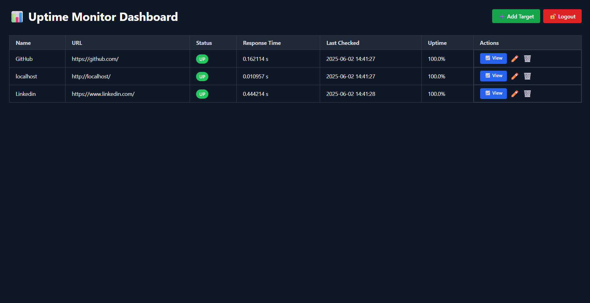
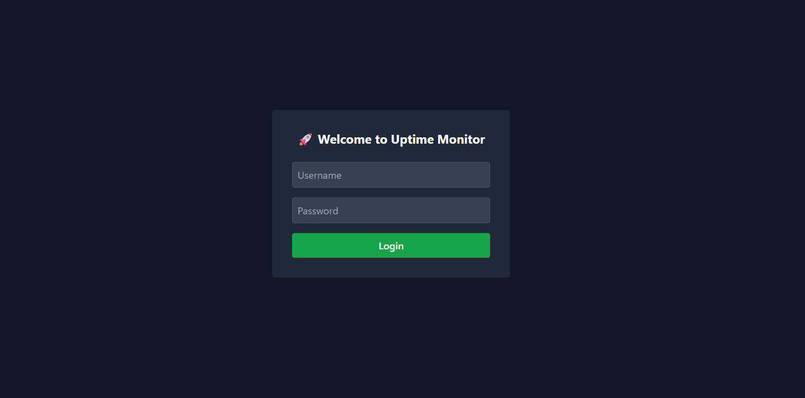
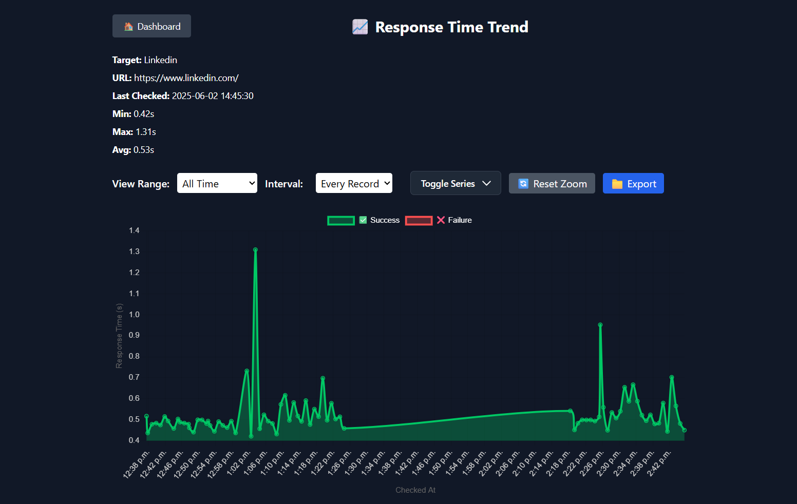

# Uptime Monitor Dashboard



## 🔍 Overview

The **Uptime Monitor Dashboard** is a lightweight yet powerful self-hosted tool built with **FastAPI**, **Jinja2**, and **MySQL**, designed to track the availability and performance of critical endpoints and web services. This app provides a beautiful web-based dashboard to:

* 🔄 Periodically check target URLs
* 📈 View uptime stats and response times
* ✏️ Add, edit, and delete target endpoints
* 🔐 Secure access with token-based authentication

## 🚀 Why We Built This

Modern SaaS or production systems often rely on third-party monitoring tools or limited manual pings to ensure uptime. We built this tool to:

* Eliminate dependencies on third-party monitoring services
* Allow local, internal or intranet monitoring without internet
* Provide a simple and clean UI for operations/IT teams
* Enable future extensibility (Slack alerts, historical analytics, etc.)

## ✨ Features

* 🧾 **Dashboard View**: Real-time list of all targets with status, response times & uptime %
* ➕ **Target Management**: Add, edit, delete monitoring targets
* 🔐 **Login & Auth**: Token-based secure access with optional default admin
* 📊 **Historical Charts**: View response time graphs per target
* 💥 **Retry & Cooldown**: Configurable retries and cooldowns for each target
* 💾 **MySQL Support**: Switched from SQLite to MySQL for production-grade storage
* 📦 **Clean HTML (Jinja2)**: Pure HTML+JS+Tailwind for frontend simplicity
* 📤 **Export & Trend Controls**: Export data, toggle success/failure, zoom/pan trends

## 📷 Screenshots

### 🔐 Login



### 📊 Dashboard


### ✏️ Add Target


### 📈 Trend View



## ⚙️ Setup & Usage

### 1. Clone the Repository

```bash
git clone https://github.com/yourname/uptime-monitor.git
cd uptime-monitor
```

### 2. Configure Environment Variables

Create a `.env` file with the following:

```env
DB_USER=your_user
DB_PASSWORD=your_password
DB_HOST=localhost
DB_PORT=3306
DB_NAME=uptime_monitor
ADMIN_USERNAME=admin
ADMIN_PASSWORD=securepassword
# Optional - for future alerts
TELEGRAM_BOT_TOKEN=
TELEGRAM_CHAT_ID=
```

### 3. Install Dependencies

```bash
pip install -r requirements.txt
```

### 4. Run the App

```bash
uvicorn app.main:app --reload
```

### 5. Access Dashboard

Go to `http://localhost:8000/login` and log in using the default admin credentials.

## 🛡 Authentication

All routes are protected via **JWT token authentication**.

* Token is stored in `localStorage`
* Session expiry is automatically handled
* A `/api/token/validate` endpoint is used to check session validity on page load

## 🧩 Tech Stack

* Backend: **FastAPI**, **SQLAlchemy**, **MySQL**, **Pydantic**
* Frontend: **Jinja2**, **Tailwind CSS**, **Vanilla JavaScript**
* Auth: **OAuth2 with Password + Bearer Token**

## 📌 Roadmap

* [x] Add/Edit/Delete Targets with Retry/Cooldown
* [x] Protect all endpoints and frontend routes
* [x] Login and Token handling via HTML/JS
* [x] Export trend data to CSV
* [x] Zoom & Pan chart with Chart.js plugin
* [ ] Add dark/light mode toggle
* [ ] Implement Slack/Webhook alerts
* [ ] User management (CRUD)
* [ ] Deployment with Docker

## 🤝 Contributing

Pull requests are welcome. Please open issues first to discuss what you would like to change.

---

Built with ❤️ by Mohammed Raquib 🚀
